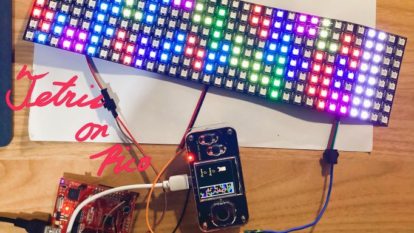
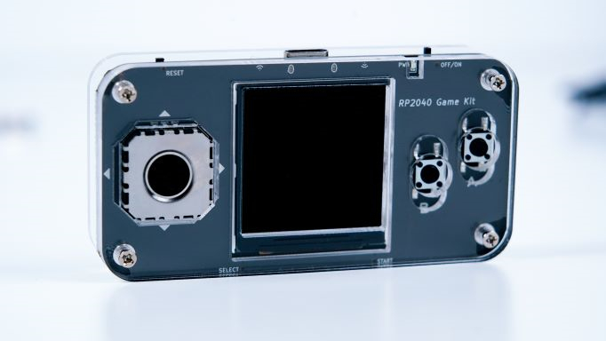
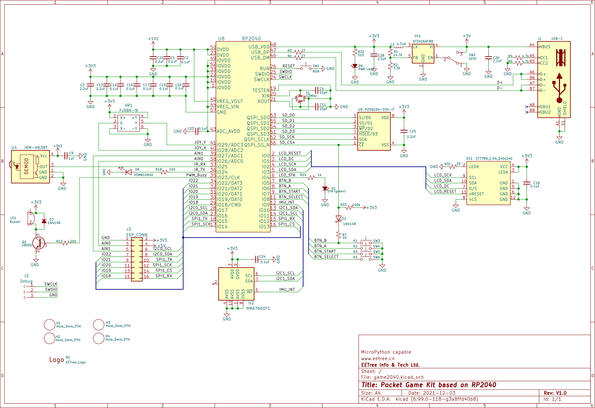

# Tetris in MicroPython

game play demo: https://youtu.be/0AJZ8k9wzJs 

## Game play usage

- Use joystick control block move around
- Button B drop down
- Button A rotate
- Start button restart game
- Select button pause game

## Features

- Play tetris theme
- can use accelerometer to control block move around

## Used libraries

- [ws2812-SPI](https://github.com/nickovs/ws2812-SPI) located at: `libs/ws2812.py`
- [buzzer_music](https://github.com/james1236/buzzer_music) located at: `libs/buzzer_music.py`
- [st7789_mpy](https://github.com/russhughes/st7789_mpy) build in firmware located at: `firmware/firmware.uf2`
- [MMA7660_driver_mpy](https://github.com/vertexi/MMA7660_driver_mpy) located at: `libs/mma7660.py`

## Pin connection

Every pin setup are written in main.py

### LCD ST7789

- Pin 2 ---- SPI SCK ---- SCL
- Pin 3 ---- SPI MOSI ---- SDA
- Pin 0 ---- ST7789 Reset ----- nRESET
- Pin 1 ---- ST7789 DC ---- D/C

### Buttons

- Pin 5 ---- Button B
- Pin 6 ---- Button A
- Pin 7 ---- Button Start
- Pin 8 ---- Button Select

### Accelerometer MMA7660

- Pin 11 ---- I2C SCL ----- SCL
- Pin 10 ---- I2C SDA ----- SDA
- MMA7660 INT is not connected

### LED Array(aka WS2812)

- Pin 15 ---- SPI MOSI ---- DIN
- Pin 14 ---- SPI SCK ----- not connected
- Pin 12 ---- SPI MISO ----- not connected

## Buzzer

- Pin 23 ---- Buzzer

## Todo

- [x] pause
- [ ] text message
- [x] score
- [x] replay
- [x] button noise(set don't allow consecutive action)
- [ ] speed setting
- [x] color
- [x] music
- [ ] width setting
- [ ] settings
- [ ] score change music
- [ ] central
- [ ] zen mode
